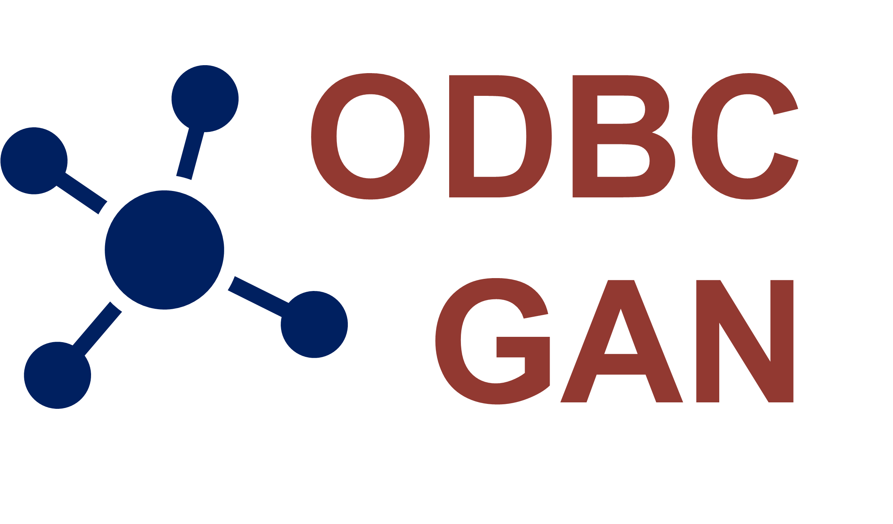

# ODBC-GAN: An integrated GAN model for outlier detection and batch correction in multi-sample and multi-modal transcriptomics
We propose a Generative Adversarial Networks called **ODBC-GAN** (**O**utlier **D**etection and **B**atch **C**orrection
**GAN**), which can detect different types of outlier observations (cells or spots), detect the subtypes of outliers further,
and correct batch effects among multi-sample datasets. ODBC-GAN has two main modes (SC and SRT), which can be suitable for
single-cell or spatially resolved transcriptomics dataset. ODBC-GAN in SC mode can solve these problem by gene expression
of cells, and SRT mode combines gene expression, position information, and slice image of spots.

 

 

## Documentation
The documentation about ODBC-GAN is available on https://catchxu.github.io/ODBC-GAN-tutorial/

## Citation
Coming soon.
